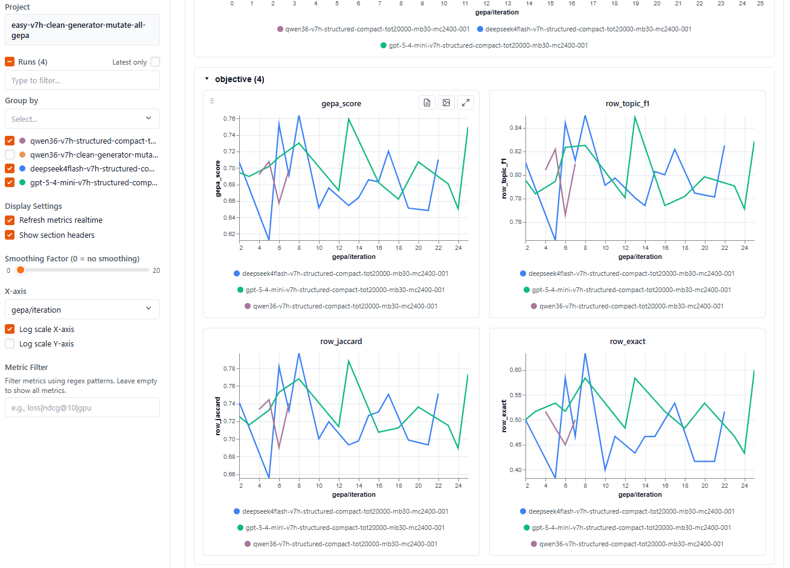

# OpenClaw Label GEPA

Clean package for OpenClaw topic-label benchmark and GEPA optimization regimes.

This repo is intended to replace the exploratory `gepa-batch-openclaw` workspace for stable work:

- load frozen label datasets from local files or Hugging Face
- define reproducible benchmark/GEPA regimes
- score plain-label and JSON-label model outputs
- keep prompts, schemas, and baseline results together


## Layout

```text
src/openclaw_label_gepa/   reusable Python package
datasets/openclaw-label-v7a/ HF dataset publication bundle
regimes/v7h-clean-generator-mutate-all/  v7h clean generator-mutate-all regime
regimes/v7i-guarded-generator-mutate-all/ v7i guarded generator-mutate-all regime
scripts/                   thin command-line entry points
tools/runners/             current GEPA/benchmark runner scripts
tools/data-build/          data construction scripts
tests/                     unit tests for stable package behavior
runs/                      selected published run data
```

## Regime Convention

Each runnable regime lives under `regimes/<name>/` and should define these stable paths in
`regime.yaml`:

- `prompts/task-template-<name>.md`
- `prompts/vanilla-labeler[-plain]-<name>.md`
- `default_variant`, when the regime should default to `plain` rather than `structured`
- `prompts/seed-policy-vanilla-<name>.md`, when GEPA should start from a seed policy
- `data/*.jsonl` split files plus a split manifest
- `trackio.project`, `trackio.group`, `trackio.local_dir`
- `run_defaults.run_name_template`

The regime file is the source of truth for Trackio project/group, split paths, prompt paths,
and default GEPA knobs. Command-line flags remain available for model, variant, and run-index
overrides.

Validate a regime before starting a long run:

```bash
uv run openclaw-label-gepa --list-regimes
uv run openclaw-label-gepa --regime-info
uv run openclaw-label-gepa --doctor
uv run openclaw-label-gepa --validate
uv run openclaw-label-gepa --audit
```



## GEPA Run Plans

The active default regime is v7i guarded generator-mutate-all. v7h is retained as the
clean predecessor/comparison regime.

Print a deterministic shell command for the default v7i run:

```bash
uv run openclaw-label-gepa --plan-gepa --shell
```

Print the v7h run explicitly:

```bash
uv run openclaw-label-gepa regimes/v7h-clean-generator-mutate-all/regime.yaml --plan-gepa --shell
```

Print a v7i Gemma run with a 1600-call GEPA budget:

```bash
uv run openclaw-label-gepa \
  --plan-gepa \
  --model gemma-e4 \
  --max-metric-calls 1600 \
  --run-index 3 \
  --shell
```

Run the same generated command in runner preflight mode, without model calls or run artifacts:

```bash
uv run openclaw-label-gepa \
  --plan-gepa \
  --model gemma-e4 \
  --max-metric-calls 1600 \
  --run-index 3 \
  --runner-preflight \
  --shell
```

Execute that preflight directly:

```bash
uv run openclaw-label-gepa \
  --plan-gepa \
  --model gemma-e4 \
  --max-metric-calls 1600 \
  --run-index 3 \
  --runner-preflight \
  --run
```

Start the real run by removing `--runner-preflight`:

```bash
uv run openclaw-label-gepa \
  --plan-gepa \
  --model gemma-e4 \
  --max-metric-calls 1600 \
  --run-index 3 \
  --run
```

Print three benchmark replay commands for the base v7i policy:

```bash
uv run openclaw-label-gepa --plan-benchmark --benchmark-run base --repeat 3 --shell
```

Start the local Trackio dashboard for v7i:

```bash
uv run openclaw-label-gepa --trackio-command
uv run openclaw-label-gepa --trackio-command --run
```

The generated GEPA/benchmark commands include `cd <repo-root>` and set an absolute
`TRACKIO_DIR`, plus `--project`, `--trackio-group`, `--run-root`, and `--run-name`
from the regime so Trackio dashboards and local artifacts line up.

Canonical Trackio streams:

- `score/val/proposal`: OpenClaw full-valset score for the candidate just evaluated.
- `score/val/best`: OpenClaw full-valset best-so-far score.
- `gepa/objective/*`: GEPA frontier objectives, emitted by the GEPA fork.
- `openclaw/objective/val/proposal_gepa_score`: audit-detail alias for `score/val/proposal`.
- `openclaw/objective/val/best_gepa_score`: audit-detail alias for `score/val/best`.
- `openclaw/diagnostic/val/*`: OpenClaw full-valset diagnostic metrics.
- `candidate/*`: compact candidate policy health telemetry.

## Quick Checks

```bash
uv sync --dev
uv run openclaw-label-gepa --list-regimes
uv run openclaw-label-gepa --regime-info
uv run openclaw-label-gepa --doctor
uv run openclaw-label-gepa --audit
uv run ruff check .
uv run ty check
uv run pytest
uv run openclaw-label-gepa --validate
uv run openclaw-label-gepa --plan-gepa --model gemma-e4 --run-index 7 --shell
```

For a first-run checklist, including Hugging Face dataset download commands, see
[`docs/setup.md`](docs/setup.md).

## Dataset Boundary

Stable generated data should live in the published Hugging Face dataset, while
`regimes/*/data/` keeps the local split bundle needed for reproducible runs. Set
`OPENCLAW_LABEL_DATASET_REPO=<namespace/dataset-repo>` when refreshing local
data from the Hub.
